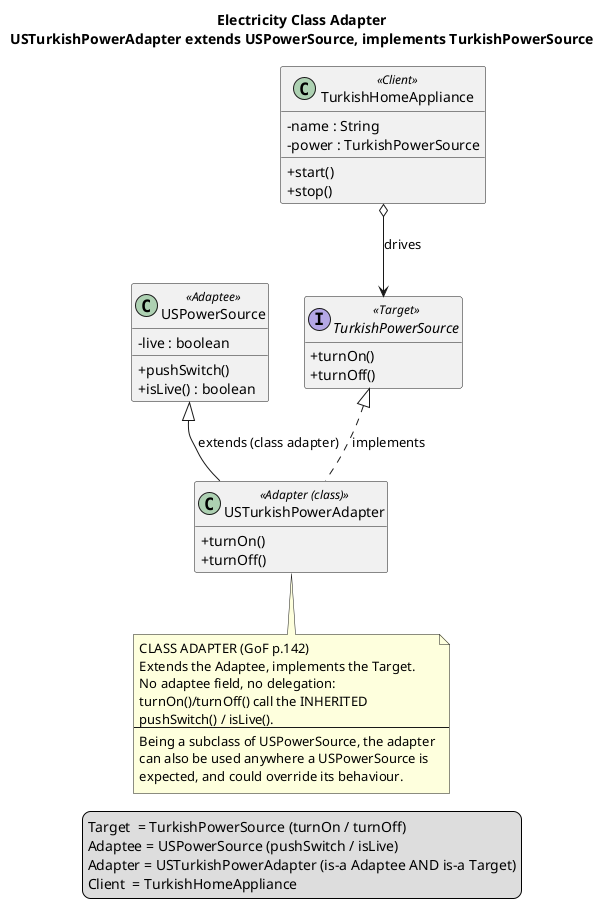

<!--
Model: Claude Opus 4.8 (1M context)
Created: 2026-07-03
-->

# Adapter — Electricity Class Adapter (class diagram)

This diagram models the code in
[`java/dev/kaldiroglu/adapter/gof/electricity/`](../java/src/main/java/dev/kaldiroglu/adapter/gof/electricity)
— the electricity **class adapter** from the course slides. The same design is implemented in C#,
Python, and C++ under each language's `electricity/` sub-package.

Format: **PlantUML**. Render with the PlantUML CLI/extension, or paste into
<https://www.plantuml.com/plantuml>. A standalone copy lives next to this file as
[`electricity-class-adapter.puml`](./electricity-class-adapter.puml).

## Participants

| GoF role | Class in this example | Key operations |
|----------|------------------------|----------------|
| **Target** | `TurkishPowerSource` *(interface)* | `turnOn()`, `turnOff()` |
| **Adaptee** | `USPowerSource` | `pushSwitch()`, `isLive()` |
| **Adapter** (class) | `USTurkishPowerAdapter` | `extends USPowerSource implements TurkishPowerSource` |
| **Client** | `TurkishHomeAppliance` | `start()`, `stop()` (holds a `TurkishPowerSource`) |

## PlantUML

## Reading the diagram

- The adapter has **two** generalization arrows: a **dashed** one to `TurkishPowerSource`
  (*implements* the Target) and a **solid** one to `USPowerSource` (*extends* the Adaptee). Those
  two arrows *are* the class adapter — it is simultaneously an `USPowerSource` and a
  `TurkishPowerSource`.
- There is **no association arrow** from `USTurkishPowerAdapter` to `USPowerSource` (no "has-a"),
  because a class adapter reuses the adaptee by **inheritance**, not composition. Contrast the
  object adapter, which would show `Adapter o--> Adaptee`.
- The client `TurkishHomeAppliance` depends only on the `TurkishPowerSource` interface
  (`o-->`), so it never sees `USPowerSource` — the whole point of the pattern.
