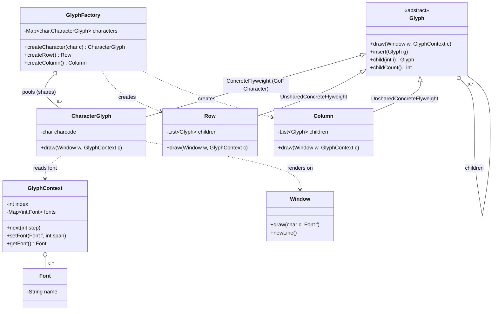

# Flyweight Pattern (Structural) — GoF "Lexi" Example

*For further enquiry please contact Akin Kaldiroglu at akin@kaldiroglu.dev*

**Project:** Structural Design Patterns course — Flyweight
**Created:** 2026-06-22
**Source:** Gamma, Helm, Johnson, Vlissides, *Design Patterns: Elements of Reusable Object-Oriented Software*, **Flyweight, pp. 195–206**.

This module reproduces GoF's motivating example for Flyweight — the **Lexi** document editor — in **Java**, **C#**, and **Python**. The three implementations are deliberately kept structurally identical so the same diagram and the same explanation apply to all of them.

---

## Why Flyweight? (the problem, p. 195)

A document editor would like to treat *everything* — including every single character — as an object, so that the same machinery handles text, lines, figures, and tables uniformly. But a naive design allocates one object **per character occurrence**. A modest document has hundreds of thousands of characters, so this explodes memory.

> *Intent (p. 195): "Use sharing to support large numbers of fine-grained objects efficiently."*

**Flyweight's idea:** create one shared object per *distinct* character and reuse it everywhere that character appears.

### Intrinsic vs. extrinsic state (the heart of the pattern, p. 196)

| State | Meaning | Where it lives | Example here |
|-------|---------|----------------|--------------|
| **Intrinsic** | Context-independent; can be shared | Inside the flyweight | the character code (`'a'`) |
| **Extrinsic** | Context-dependent; *cannot* be shared | Supplied by the client at call time | the font, the position |

Because a `CharacterGlyph`'s only stored state is its code, one `CharacterGlyph('a')` can serve **every** 'a' in the document. The font and position differ per occurrence, so they are passed *into* `draw()` via a `GlyphContext` rather than stored.

---

## Structure → Participants (p. 198)

| GoF participant | This example |
|-----------------|--------------|
| **Flyweight** | `Glyph` (abstract) |
| **ConcreteFlyweight** | `CharacterGlyph` — GoF's *Character* (intrinsic state = char code, shared) |
| **UnsharedConcreteFlyweight** | `Row`, `Column` (own their children, not shared) |
| **FlyweightFactory** | `GlyphFactory` (pools and shares `CharacterGlyph`s) |
| **Client** | the demo (`Main` / `Program` / `demo.py`) + `GlyphContext` holding extrinsic state |

> **Note on fidelity:** GoF stores the per-position font in a compact **BTree** (p. 202). As is common when teaching the pattern, we substitute a plain `index → Font` map inside `GlyphContext`. Everything else mirrors the book's structure.
>
> **Naming:** GoF's *Character* participant is named `CharacterGlyph` here so it doesn't clash with the built-in character types of Java (`java.lang.Character`), C# (`System.Char`), and Python. The method names (`createCharacter`, …) keep the domain word "character".

---

## UML Class Diagram

Rendered sources live in [`uml/flyweight.puml`](uml/flyweight.puml) (PlantUML, for Keynote) and [`uml/flyweight.mmd`](uml/flyweight.mmd) (Mermaid). The Mermaid version inline:



---

## What the demo shows

Each language builds the two-line document `flyweight` / `lightweight`, assigns line 1 to **Times** and line 2 to **Courier** (extrinsic state set on the `GlyphContext`), renders it, and prints the saving:

```
Character occurrences in document : 20
Distinct Character flyweights     : 9
Objects saved by sharing          : 11
```

The teaching punchline: the letter **`t`** is drawn in *Times* on line 1 and *Courier* on line 2 — **from the same shared object**. The font is never inside the flyweight.

---

## Project layout

```
Flyweight/
├── README.md            <- you are here (topic overview + UML)
├── uml/
│   ├── flyweight.puml   <- PlantUML source (render for Keynote)
│   └── flyweight.mmd    <- Mermaid source
├── java/                <- Maven project (dev.kaldiroglu.flyweight)
├── csharp/              <- .NET solution (dev.kaldiroglu.Flyweight)
└── python/              <- package dev/kaldiroglu/flyweight
```

Each language folder is self-contained with its own `README.md` and `Test.md`.

---

## Run it with

**Java** (Maven):
```bash
cd java
mvn test          # run the unit tests
mvn exec:java     # run the demo
```

**C#** (.NET):
```bash
cd csharp
dotnet test                       # run the unit tests
dotnet run --project src/Flyweight  # run the demo
```

**Python** (pytest):
```bash
cd python
python3 -m pytest                          # run the unit tests
python3 -m dev.kaldiroglu.flyweight.demo   # run the demo
```
